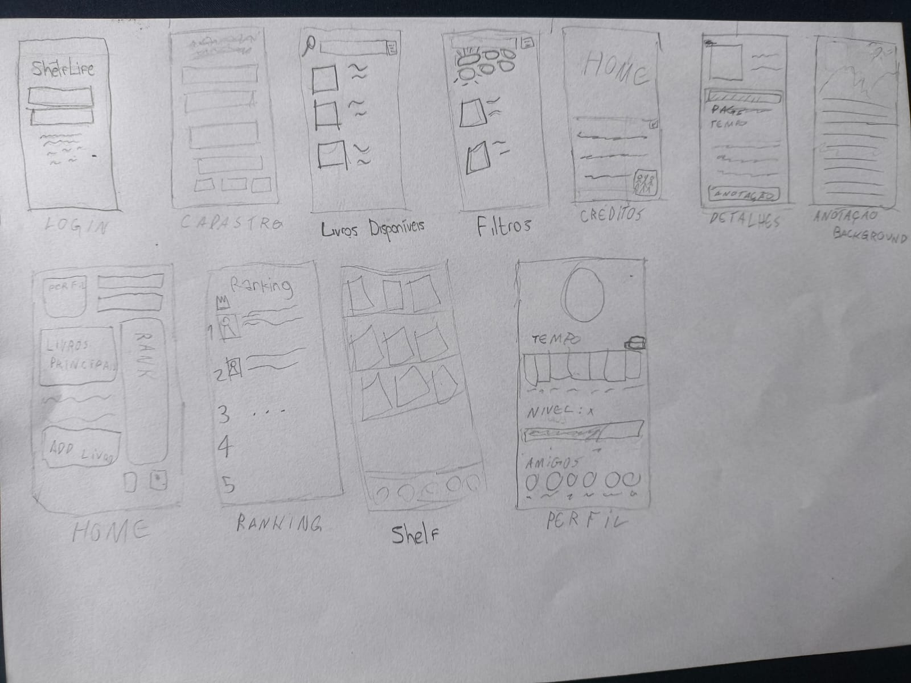
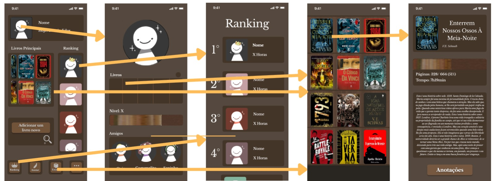

# ShelfLife

Aplicativo Android desenvolvido em Kotlin, como trabalho da disciplina. O ShelfLife permite acompanhar o progresso de leitura de vários livros ao mesmo tempo, mostrando quanto tempo de vida foi dedicado à leitura, além de contar com ranking global/de amigos e sistema de nível.

## Integrantes

- Isabella Aparecida de Matos — Tela: Home
- Jhonatan Mendes dos Santos — Tela: Perfil
- Thiago Costa Palestino — Tela: Shelf

## Canvas — Por que esse aplicativo existe?

### Qual problema esse aplicativo resolve? Para quem ele é, quem é o "usuário imaginário" de vocês?

O ShelfLife resolve a falta de visibilidade sobre o próprio hábito de leitura: leitores casuais que leem vários livros ao mesmo tempo e perdem a noção de quanto tempo realmente dedicam a isso. O "usuário imaginário" é alguém entre 16 e 50 anos, ativo em redes sociais, que gosta de acompanhar métricas pessoais (como em apps de fitness ou de estudo de idiomas) e se motiva com comparação social, como rankings e amigos.

### Por que alguém abriria esse aplicativo hoje? E por que abriria de novo amanhã?

Hoje, para registrar o progresso de um livro que acabou de começar a ler e ver em quanto tempo de vida isso já se traduziu. Amanhã, para manter a sequência de leitura, subir no ranking de amigos, ou acompanhar o avanço da barra de nível, o gancho é o mesmo de apps de gamificação: progresso visível gera retorno.

### Qual é a única coisa que o aplicativo precisa fazer bem para "funcionar" na cabeça de quem usa?

Traduzir tempo de leitura em uma métrica emocionalmente significativa de forma instantânea e visualmente satisfatória. Se essa conversão não for clara e recompensadora, o restante do aplicativo perde o sentido.

### Se fosse um produto de verdade, como ele geraria valor ou dinheiro (mesmo que de forma hipotética)?

Por meio de uma assinatura premium (estatísticas avançadas, temas de perfil, badges exclusivos) e de parcerias com editoras e livrarias, oferecendo recomendações patrocinadas de livros dentro do aplicativo ou cupons de desconto para quem atinge determinadas metas de leitura.

### Quais decisões de tela vieram dessas respostas? Deem pelo menos um exemplo concreto.

Por isso a tela de Perfil mostra o tempo total lido, em destaque, e não escondida em uma aba separada de estatísticas. Essa é a informação que mais entrega o gancho emocional do aplicativo. Da mesma forma, a seção de nível com barra de progresso fica em destaque na tela de Perfil, reforçando a mecânica de gamificação que traz o usuário de volta.

## Mockups e diagrama de fluxo

  
  

## Acompanhamento e progresso

### Que decisão o grupo tomou que valeu a pena? Por quê?

Na tela de Perfil, decidimos trocar o botão de "simular leitura" por uma barra de nível fixa já preenchida pela metade. Isso simplificou a tela sem perder o objetivo de mostrar a mecânica de progresso.

### Que erro ou trava vocês tiveram? Como resolveram (ou não resolveram)?

Dificuldades ao organizar Row/Column/Box, problemas de alinhamento, erros de sincronização do Gradle, divergências entre o mockup do Figma e o que foi possível reproduzir no Compose, etc.

### O que mudou entre o mockup original e a tela programada de verdade?

Na tela de Perfil, o mockup original previa uma seção de calendário estilo grade para mostrar o histórico de tempo de leitura. Essa seção foi substituída por uma lista dos livros mais lidos, com setas de "ver todos" tanto na seção de livros quanto na de amigos.

## Como rodar o projeto

1. Clonar este repositório
2. Abrir a pasta no Android Studio
3. Sincronizar o Gradle
4. Executar em um emulador ou dispositivo físico